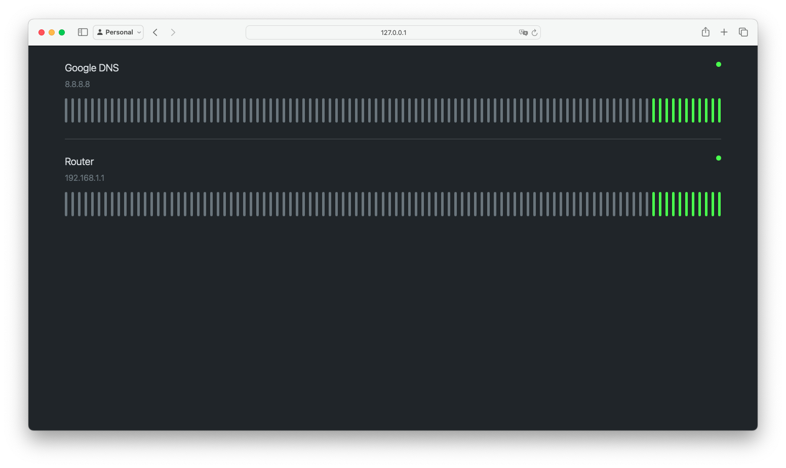

# Uptime Monitor

A simple uptime monitor that checks if a host is up or down.



## Inspiration

I wanted to monitor hosts in my network in similar way to how [UptimeRobot](https://uptimerobot.com) does it.

## Usage

Start service with WSGI, e.g. `gunicorn`:

```bash
gunicorn wsgi -b <ip-address>:<port> --chdir /path/to/uptime-monitor --worker-class eventlet
```

Also, remember to add following command to crontab to run the monitor every minute.

```
* * * * * /path/to/python -m flask --app /path/to/uptime-monitor/app/app.py iputils ping
```

## Updating

To update the monitor:

1. pull the latest changes from the repository,
2. upgrade database schema:
   ```bash
   /path/to/python -m flask --app /path/to/uptime-monitor/app/app.py db upgrade
   # or
   flask db upgrade # if you are in the root of the project and using correct venv
   ```
3. restart the service.

## Management

All commands have to be run from the root of the project.

### Add a host

```bash
flask manage add <ip-address> [--name <friendly-name>]
```

### Update name of a host

```bash
flask manage set-name <new-name> --to <ip-address>
```

### Remove host

```bash
flask manage remove <ip-address>
```
